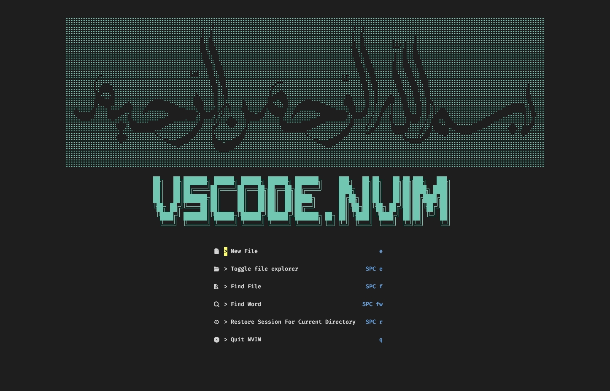

# Introduction

This repo is my Neovim Configuration for macOs. It is based on [LazyVim](https://github.com/LazyVim/LazyVim).`init.lua` is the config entry point file.

# Feature
- Using Neovim's Built-in Lsp
- Built-in a lot of useful plugins
- Specifically for `Vue3` development configuration

 `Vue3` development experience is **good**! I use it for my **daily work**.

Everyone should have his or her unique config file. So you can download this repo and modify it as you want.

# Requirements

- Neovim >= 0.11.0
- Git >= 2.30.2
- a Nerd Font(Optional)

# Installation

```bash
$ git clone --depth 1 https://github.com/xiaoliyooo/xiaoli-nvim.git ~/.config/nvim
```

# Usage

```bash
$ nvim
```

# Preview

Greeter page

